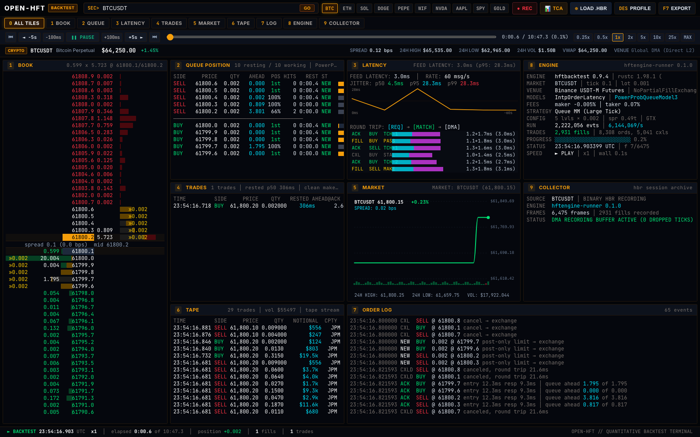

<div align="center">

# OPEN-HRT
### Quantitative Backtest Terminal

Nanosecond-accurate market microstructure simulation, L2 order book replay, and execution forensics.

<br />



</div>

---

## Overview

**OPEN-HRT** is a high-frequency trading backtesting engine and execution forensics terminal built on [hftbacktest](https://github.com/nkaz001/hftbacktest). It gives quants and algorithmic traders complete frame-by-frame visibility into exchange matching engines:

- **24-Level Order Book Ladder**: Tick-by-tick reconstruction from raw exchange packet streams.
- **Probabilistic Queue Position**: Realistic exchange-side queue modeling (`ahead | ours | behind`) with power-law fill probabilities (`PowerProbQueueModel3`, n=3).
- **Dual-Phase Latency Forensics**: Hardware feed jitter ($p_{50}, p_{95}, p_{99}$), DMA round trips, request transit (cyan), and wire confirmation (magenta).
- **Execution & Tape Blotters**: Real-time matched trade prints (Time & Sales) and strategy executions with counterparty tags, resting wait times, and notional sizes.
- **Dynamic Multi-Asset Engine**: Test strategies across 800+ crypto pairs, US equities, commodities, and FX with dynamic tick size, lot size, and price scaling.
- **Zero-Dependency Web Terminal**: Pure TypeScript and canvas-rendered dashboard running in any modern browser.
- **Regulatory TCA Export**: One-click (`F7`) Transaction Cost Analysis reports with Implementation Shortfall (IS), adverse selection markouts (+100ms to +30s), and SEC 605/606 & MiFID II compliance metrics.

---

## Quickstart

Run the web terminal locally:

```bash
cd dashboard
npm install
npm run dev
```

Open **`http://localhost:5180`** in your browser. The terminal launches immediately with preloaded historical market data.

---

## How to Record & Generate Backtest Data

OPEN-HRT uses `.hbr` (`HFTREC01`) binary archives containing nanosecond-timestamped order book states, order lifecycle events, trades, and latency telemetry.

Follow this 3-step pipeline to record live market data, run your strategy, and generate `.hbr` session files:
### Method 1: In-Browser Market Recorder (Zero CLI / Instant Replay)

You can record live exchange market data and compile `.hbr` backtest archives **directly inside the UI with zero terminal commands**:

1. Click **`[● REC]`** in the top navigation bar.
2. Select your **Target Market** (e.g., `BTC`, `ETH`, `SOL`, `DOGE`, `PEPE`, `NVDA`, `SPY`, `GOLD`).
3. Choose your **Recording Duration** (`30s`, `1 min`, `3 min`, `5 min`, or `Manual Start/Stop`).
4. Select your **Execution Simulator** (`Queue MM`, `Avellaneda-Stoikov`, `Passive Grid`) and **Latency Envelope** (`Cross-Connect 0.2ms`, `AWS Tokyo Colo 3.5ms`, `Retail 18ms`).
5. Click **`START RECORDING`** — the live HUD monitors real-time packets, L2 deltas, incoming trades, and memory buffer.
6. Once complete, click **`REPLAY IN TERMINAL`** to immediately load your backtest, **`EXPORT .HBR`** to save the archive to disk, or **`VIEW TCA TEAR SHEET`** for Wall Street-grade execution analytics.
7. Past recordings are automatically persisted in your browser's local **Saved Backtest Library (IndexedDB)** for one-click instant access.

---

### Method 2: Batch CLI Pipeline (Python / Rust Core)

For scheduled, multi-day, or high-throughput recording sessions, use the native CLI pipeline:

```
[1. Capture Raw Feed] ──> [2. Prepare & Calibrate] ──> [3. Run Simulation] ──> [4. Replay in Terminal]
  tools/collect.py            tools/prepare.py             runner / session.py         dashboard / UI
```

---

### Step 1: Record Live L2 Market Depth & Trades

Capture real-time WebSocket order book diffs and trade streams from exchange endpoints:

```bash
# Start background recording for target pairs (e.g. BTCUSDT, ETHUSDT)
python tools/collect.py start --symbols BTCUSDT ETHUSDT

# Check live ingress status, packet rates, and file sizes
python tools/collect.py status

# Stop recording when finished
python tools/collect.py stop
```

Raw compressed feeds are written to `data/raw/<symbol>_<timestamp>.gz`.

You can also use the high-performance native Rust collector:
```bash
cargo run --release -p collector -- --symbols BTCUSDT,ETHUSDT --output data/raw/
```

---

### Step 2: Normalize Feeds & Build Latency Models

Convert raw `.gz` streams into structured `.npz` arrays and calibrate empirical latency profiles:

```bash
python tools/prepare.py \
  --raw data/raw/btcusdt_20260915.gz \
  --tick-size 0.1 \
  --lot-size 0.001 \
  --mul-entry 1.0 \
  --mul-resp 1.0
```

This generates three files:
1. `data/npz/<stem>.npz`: Normalized Level 2 depth changes and trade prints.
2. `data/latency/<stem>.npz`: Feed-latency-derived order entry and acknowledgment models.
3. `data/npz/<stem>.collector.json`: Ingress packet counts and stream telemetry.

---

### Step 3: Run the Strategy & Record the Backtest (`.hbr`)

The simulation runner executes your trading strategy inside `hftbacktest`, simulates queue positions, fills orders, and records every decision frame into `.hbr`.

#### Option A: One-Command Workflow (Recommended)
This runs preparation, simulation, and staging in one command:

```bash
python tools/session.py \
  --raw data/raw/btcusdt_20260915.gz \
  --name my_backtest \
  --symbol BTCUSDT \
  --tick-size 0.1 \
  --lot-size 0.001
```

The resulting file is automatically saved to `dashboard/public/sessions/my_backtest.hbr`.

#### Option B: Manual Rust Simulation Runner
Build and invoke the native simulation runner directly:

```bash
# 1. Build native runner
(cd runner && cargo build --release)

# 2. Execute strategy simulation
./runner/target/release/open-hrt-runner \
  --data data/npz/btcusdt_20260915.npz \
  --latency data/latency/btcusdt_20260915.npz \
  --symbol BTCUSDT \
  --tick_size 0.1 \
  --lot_size 0.001 \
  --queue-model power3 \
  --frame_ms 100 \
  --levels 24 \
  --out dashboard/public/sessions/my_backtest.hbr
```

#### Simulation Configuration Parameters
| Parameter | Description | Default |
|---|---|---|
| `--queue-model` | Queue priority model (`power3`, `power2`, `log2`, `risk_adverse`) | `power3` |
| `--frame_ms` | Decision and recording frame interval in milliseconds | `100` |
| `--levels` | Order book depth levels recorded per side per frame | `24` |
| `--const_latency_us` | Fixed latency override in microseconds `entry,response` (e.g. `500,500`) | Measured |
| `--grid-num` | Number of quoting levels per side for grid strategies | `5` |
| `--order-qty` | Order lot size per level | `0.002` |

---

### The `.hbr` Binary Recording Layout (`HFTREC01`)

The output `.hbr` binary format contains:
- **Header**: 8-byte magic `HFTREC01`.
- **Metadata**: JSON header storing symbol, tick size, lot size, exchange name, and total event count.
- **Time Index**: Seek table mapping timestamps to byte offsets for sub-millisecond scrubber navigation.
- **Frames**:
  - Exchange timestamp and local arrival timestamp.
  - 24-level Bid/Ask book ladder with resting quantities.
  - Active child orders with price, leaves quantity, and queue position (`front` / `ahead` / `behind`).
  - Executions, fills, and cancellation records.
  - Feed latency samples ($p_{50}, p_{95}, p_{99}$).

---

## Loading Sessions in the Dashboard

You can replay backtest recordings using three methods:

1. **URL Parameter**:
   Place `<name>.hbr` into `dashboard/public/sessions/` and navigate to:
   ```
   http://localhost:5180/?session=my_backtest
   ```
2. **Drag & Drop**:
   Drag any `.hbr` file from your computer and drop it anywhere onto the terminal browser window.
3. **File Picker Button**:
   Click **`[⊕ LOAD .HBR]`** in the top navigation bar to open your file browser.

---

## Dynamic Multi-Asset Simulation (800+ Assets)

OPEN-HRT includes an on-the-fly microstructure scaling engine (`session_factory.ts`). When you switch symbols using the search bar (`SEC>`), quick pills (`BTC`, `ETH`, `SOL`, `NVDA`, `GOLD`), or asset directory (`F8`):

- Price trajectories rescale dynamically to the target asset's market price.
- Tick sizes, lot sizes, spread dynamics, and book depths re-anchor automatically.
- Book ladders, execution blotters, and trade tapes reflect the active instrument immediately without needing separate multi-gigabyte recordings.

---

## Terminal Navigation & Shortcuts

Press keys `0` through `9` to toggle between the 9-panel overview and individual full-screen panels:

| Key | Tile | Description |
|:---:|:---:|---|
| **`0`** | **ALL TILES** | Full 9-panel terminal overview. |
| **`1`** | **BOOK** | Level 2 book ladder with centered price column and split queue bars. |
| **`2`** | **QUEUE** | Queue breakdown (`ahead \| ours \| behind`), hits, and resting wait times. |
| **`3`** | **LATENCY** | Feed receipt latency sparkline, jitter percentiles, and wire transit bars. |
| **`4`** | **EXECUTIONS** | Tabular execution blotter with fill prices, resting times, and notionals. |
| **`5`** | **MARKET** | Mid-price canvas with reference gridlines and volume bars. |
| **`6`** | **TRADES** | Tabular Time & Sales tape with trade timestamps, side, size, and counterparty. |
| **`7`** | **ORDER LOG** | Lifecycle audit stream (`SUBMIT`, `ACK`, `FILL`, `CXL`). |
| **`8`** | **ENGINE** | Kernel throughput, tick rate, fill ratio, and memory footprint. |
| **`9`** | **COLLECTOR** | Network ingress telemetry, packet counts, and payload integrity. |

### Playback & Tools
| Key | Action |
|---|---|
| **`SPACE`** | Play / Pause replay backtest execution |
| **`←` / `→`** | Step 5 seconds backward / forward (`Shift` for 30s) |
| **`↑` / `↓`** | Adjust playback speed multiplier (`0.25x` to `MAX`) |
| **`F8`** or **`D`** | Open Security Description Profile modal (`[DES PROFILE]`) |
| **`F7`** | Export Transaction Cost Analysis report (`[EXPORT]` TCA) |
| **`ESC`** | Close open modals |

---

## Regulatory TCA Reports (`F7`)

Click **`[EXPORT]`** or press **`F7`** to export an institutional execution quality report:

- **Implementation Shortfall (IS)**:
  $$\text{IS}_{\text{bps}} = \text{Side} \times \left( \frac{P_{\text{fill}} - P_{\text{arrival}}}{P_{\text{arrival}}} \right) \times 10{,}000$$
  Measures true execution slippage against the mid-market price at decision arrival.

- **Adverse Selection Markouts (+100ms, +1s, +5s, +30s)**:
  $$\text{Markout}_\tau = \text{Side} \times \left( \frac{P_{\text{mid}}(t + \tau) - P_{\text{fill}}}{P_{\text{fill}}} \right) \times 10{,}000$$
  Determines whether resting passive orders captured spread or suffered toxic adverse selection from informed order flow.

- **Regulatory Compliance**:
  - **SEC Rule 605/606**: Effective vs. quoted spread, price improvement rates, and order routing statistics.
  - **MiFID II RTS 27/28**: Best-Execution verification for trading desks and asset managers.

---

## Directory Structure

```
├── dashboard/              # Vite + TypeScript web terminal
│   ├── src/
│   │   ├── main.ts         # App initialization & tile grid manager
│   │   ├── nav_bar.ts      # Top navigation, playback scrubber, and asset search
│   │   ├── session.ts      # Binary .hbr parser and clock
│   │   ├── session_factory.ts # Multi-asset dynamic scaling engine
│   │   ├── tca_engine.ts   # Implementation shortfall & markout analytics
│   │   └── panels/         # Tile renderers (Tiles 1 to 9)
│   └── public/sessions/    # Preloaded .hbr binary recordings
├── runner/                 # Native Rust backtest runner & binary recorder
│   └── src/
│       ├── main.rs         # Strategy runner CLI
│       ├── queue.rs        # Queue position model integration
│       └── record.rs       # HFTREC01 binary serializer
├── tools/                  # Python data preparation and collector utilities
│   ├── collect.py          # WebSocket L2 depth & trade collector
│   ├── prepare.py          # Raw feed to normalized NPZ & latency generator
│   └── session.py          # 1-command pipeline: raw feed -> .hbr session
└── data/                   # Data directory (raw feeds, npz caches, session files)
```

---

## License

OPEN-HRT is open-source software released under the [MIT License](LICENSE).
Bitmap fonts from The Ultimate Oldschool PC Font Pack (`WebPlus_IBM_VGA_9x16`, `WebPlus_IBM_EGA_8x8`) licensed under CC BY-SA 4.0; Departure Mono licensed under SIL Open Font License.
